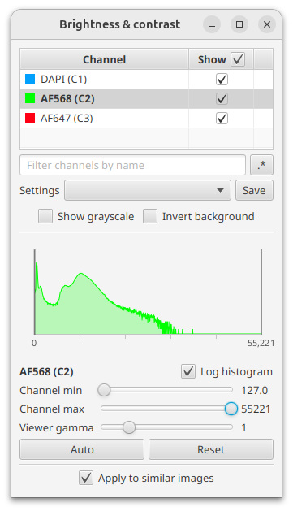
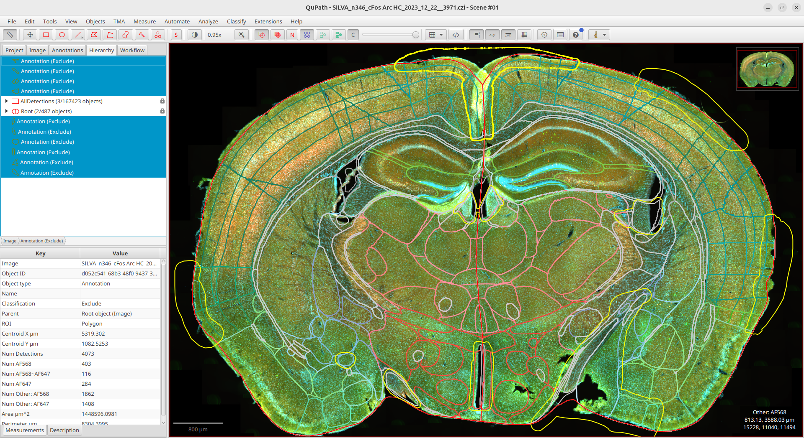
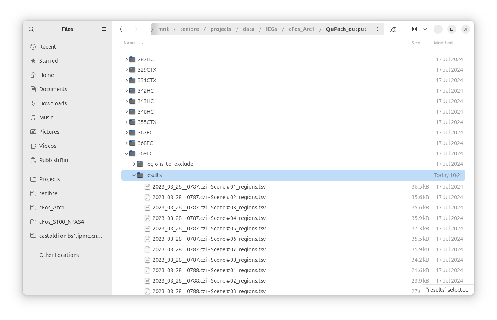

# Multi-channel image analysis

With this tutorial we will guide you into:

* reading a configuration file of BraiAnDetect
* apply the parameters for cell detection specified in the config file for each image channel
* compute markers' co-labelling
* exclude brain regions
* export results to CSV file

All code in this page pretty much traces [this script](https://github.com/carlocastoldi/qupath-extension-braian/blob/v{{braian_qupath.latest}}/src/main/resources/scripts/compute_classify_overlap_export_exclude_detections.groovy), available in `Extensions ‣ BraiAn ‣ scripts` in QuPath.

## Before we start

We want to import all necessary dependencies

```groovy
import qupath.ext.braian.*
import qupath.ext.braian.config.*

import static qupath.lib.scripting.QP.*
```

## Configuration file
BraiAnDetect can read a [YAML](https://en.wikipedia.org/wiki/YAML) configuration file to specify basic information about a project and its data.

!!! tip "Template for Configuration file"
    You don't know where to start from?</br>
    Take a look at [the template](https://github.com/carlocastoldi/qupath-extension-braian/blob/v{{braian_qupath.latest}}/BraiAn.yml), change it according to your data and continue reading this tutorial.
    You are on the right path!

Here we use the [example](https://github.com/carlocastoldi/qupath-extension-braian/blob/v{{braian_qupath.latest}}/BraiAn.yml) configuration file that is in the extension's Git repository, and here commented.

First we read a file named `BraiAn.yml`. It searches it in the QuPath projects's folder or, if not found, in the parent folder which, supposedly, contains all the projects of the same experiment.

```groovy
var config = ProjectsConfig.read("BraiAn.yml")
```


## Region of interests

BraiAnDetect operates over regions of interests defined in each image. You can select them by specifying their [QuPath classification](https://qupath.readthedocs.io/en/stable/docs/concepts/objects.html#classification) in the configuration file:

<div class="snippet">
  <pre><span class="filename">BraiAn.yml</span><code class="language-yaml hljs">classForDetections: null</code></pre>
</div>

You can call `getAnnotationsForDetections()` to search such annotations. If `null` it returns a full-image annotation, effectively selecting the whole image with no focus on any particular region.

```groovy
ImageData imageData = getCurrentImageData()
PathObjectHierarchy hierarchy = imageData.getHierarchy()
Collection<PathAnnotationObject> annotations = config.getAnnotationsForDetections(hierarchy)
```

## Segmentation

Given a list of `annotations`, BraiAnDetect then can manage object segmentation, within the ROIs, for each of the given image channels.\
As of now, segmentation is managed through [QuPath algorithm](https://qupath.readthedocs.io/en/stable/docs/tutorials/cell_classification.html#run-cell-detection-command) and all of its parameters can be specified in the configuration file, for each channel:

<div class="snippet">
  <pre><span class="filename">BraiAn.yml</span><code class="language-yaml hljs">channelDetections:
  - name: "AF568" # cFos
    ...

  - name: "AF647" # Arc
    parameters:
      requestedPixelSizeMicrons: 1
      # Nucleus parameters
      backgroundRadiusMicrons: 20
      backgroundByReconstruction: true
      medianRadiusMicrons: 0.0
      sigmaMicrons: 1.5
      minAreaMicrons: 40.0
      maxAreaMicrons: 1000.0
      # Intensity parameters
      # threshold: -1
      watershedPostProcess: true
      # Cell parameters
      cellExpansionMicrons: 5.0
      includeNuclei: true
      # General parameters
      smoothBoundaries: true
      makeMeasurements: true</code></pre>
</div>

For an in-depth description of what each parameter do, we suggest you to look at the [example](https://github.com/carlocastoldi/qupath-extension-braian/blob/v{{braian_qupath.latest}}/BraiAn.yml) configuration file.

For each image channel, we can compute the detections within the ROIs accordingly to `detectionsConf.parameters`:

```groovy
var server = imageData.getServer()
var allDetections = []
for(ChannelDetectionsConfig detectionsConfig in config.channelDetections) {
    var channel = new ImageChannelTools(detectionsConf.name, server)
    try {
        var detections = new ChannelDetections(channel, annotations, detectionsConf.parameters, hierarchy)
        allDetections.add(detections)
    } catch (IllegalArgumentException ignored) {}
}
```

!!! important "Detection containers"
    Whenever BraiAnDetect creates a `ChannelDetections` object, it will "insert" each QuPath detection inside a QuPath annotation called, in BraiAn terms, **detection container**. Containers will be inserted in QuPath's hierarchy right under the corresponding object in `annotations`.

    _Read more about [detection containers](braian-qupath.md#detection-containers)._

### Automatic threshold

Sometimes it is hard to determine the best threshold used by QuPath's watershed algorithm for the a whole brain. Lots of factors may play a role in each section image (section size, section quality, acquisition, density,...), making it a daunting task to fine tune the threshold to the best value, for each of them.\
For this reason BraiAnDetect offers an interface for automatically choosing a threshold based on the intensity histogram derived from the corresponding image.



In order to apply this automatic-threshold, you specify a couple of `histogramThreshold` parameters in the configuration file, and BraiAn will replace any value in `threshold` with the one computed from the image histogram.

<div class="snippet">
  <pre><span class="filename">BraiAn.yml</span><code class="language-yaml hljs">channelDetections:
  - name: "AF568" # cFos
    ...

  - name: "AF647" # Arc
    parameters
      ...
      histogramThreshold:
        resolutionLevel: 4
        smoothWindowSize: 15
        peakProminence: 30
        nPeak: 1
    ...</code></pre>
</div>

Effectively, it:

* computes the intensity histogram of the current image at the given resolution level. The higher `resolutionLevel` the faster, at the cost of sampling fewer pixels from which to build the histogram;
* applies a moving average to smooth the histogram's curve. The bigger the `smoothWindowSize`, the more local small peaks will be flattened out;
* filters out the local maxima having a distance from the surrounding local minima smaller than `peakProminence`. The remaining maxima are considered _peak_;
* picks the `nPeak`-th peak and uses it as **threshold** for the current image.

What it does behind the curtain is very similar to the following python code:

```groovy
// QuPath script
import qupath.ext.braian.*

var server = getCurrentServer()
println server.nResolutions()
var resolutionLevel = 4
var h = new ImageChannelTools("AF568", server).getHistogram(resolutionLevel)
println h.values
```

```python
# python script
import numpy as np
import plotly.graph_objects as go
from scipy.signal import filtfilt
from scipy.signal import find_peaks

h = [633474, 3981, 5143, 2732, 1444, 1116, 930, 561, 322, ...] # histogram from QuPath script
h = np.array(h)
smoothWindowSize = 15
peakProminence = 30

smoothed = filtfilt(np.ones(smoothWindowSize) / smoothWindowSize, 1, h[5:])
peaks = find_peaks(smoothed, prominence=peakProminence)

fig = go.Figure([
    go.Scatter(y=h[5:], name="histogram"),
    go.Scatter(y=smoothed, name="smoothed", marker_color="green"),
    go.Scatter(x=peaks[0], y=smoothed[peaks[0]], name="peaks",
               mode="markers", marker_size=8, marker_color="red")
])\
.update_layout(
    paper_bgcolor="rgba(0,0,0,0)",
    plot_bgcolor="rgba(0,0,0,0)",
    template="simple_white"
).update_xaxes(title="#pixels", range=(0,len(h)))\
.update_yaxes(type="log", range=[0,4])
```


!!! note
    Often the intensity histograms has very high values for `x=0` and surroundings, due to images having a black background. This, however, is not considered a _peak_ because it misses the left-hand local minimum.

## Find co-labelled detections

Sometimes our experiment requires that we identify and count co-labelled segmentation.
BraiAn can help you achieving this, by offering an interface for computing all possible combinations of co-labelled detections.

This requires you to pass BraiAn all the pre-computed `ChannelDetections` between which you want to find the co-labels into an `OverlappingDetections` object. BraiAn will then use one set of detections (i.e. _control_ detections) to check whether there are other detections whose centroid fall inside the control's perimeter.

!!! example
    Let $A$, $B$ and $C$ be the pre-computed detections, with $A$ as _control_. Then the computed co-labelling will only be between $(A, B)$ and $(A, C)$. If you desire to have $(B, C)$ co-labelling as well, you need to compute a new `OverlappingDetections`.

Co-labelling with one single _control_ can also be instructed in the configuration file:

<div class="snippet">
  <pre><span class="filename">BraiAn.yml</span><code class="language-yaml hljs">detectionsCheck:
  apply: true
  controlChannel: "AF568"
</code></pre>
</div>

Once defined the _control_ channel, we can select the detections computed on that same channel as well as all the detections computed on the other channels, and use them to create an `OverlappingDetections` object:

```groovy
var overlaps = []
Optional<String> control
if ((control = config.getControlChannel()).isPresent() ) {
    String controlChannelName = control.get()
    var controlChannel = allDetections.find { it.getId() == controlChannelName }
    var otherChannels = allDetections.findAll { it.getId() != controlChannelName }
    overlaps = [new OverlappingDetections(controlChannel, otherChannels, true, hierarchy)]
}
```
## Region exclusions



Sometimes we would like to discard some parts of a section—be it for problems with the tissue, imaging or registration to an atlas—but we would still like to keep some portions!\
BraiAn allows you to define which regions to _exclude_ from the aligned brain section.
You can appoint these regions by **completely** covering them with ad-hoc annotations—i.e. they can't be an annotation imported by ABBA—and [classified](https://qupath.readthedocs.io/en/stable/docs/concepts/objects.html#classification) with `"Exclude"`.
If you don't have it, create it.

There are two ways to create these _exclusion_ annotations:

1. by drawing them over the regions to exclude;
2. by duplicating the annotations of the regions to exclude.

!!! tip
    If you want to be sure that you selected all the brain regions that you intended to exclude, you can click on `Extensions ‣ BraiAn ‣ Show regions currently excluded`.

!!! tip
    When working on the exclusions, we highly suggest you to [lock](https://qupath.readthedocs.io/en/stable/docs/starting/annotating.html#locking-unlocking) the brain annotations to avoid disrupting the hierarchy by mistake.

In the event that a mistake done during the exclusions step has slipped away, BraiAn will, annoyingly, let you know; either while executing a QuPath script, or later during the [python analysis](read_qupath_data.ipynb). With the objective of making this step less frustrating, [`AtlasManager.fixExclusions()`](https://carlocastoldi.github.io/qupath-extension-braian/docs/qupath/ext/braian/AtlasManager.html#fixExclusions()) finds the most common mistakes and tries to correct them.

### Drawn exclusions

You can draw an annotation around the region you want to exclude using the closed polygon tool (`P`) or the brush tool (`B`).
The resulting annotation should contain all the boundaries of the region to be excluded.\
This means that the shapes should completely cover the brain regions; adjecent regions won't be affected if portions of their annotation fall within the exclusion annotation.

### Duplicated exclusions

You can duplicate a brain region annotation by selecting it and pressing `Shift+D` in QuPath.
The duplicated shape—i.e. the one to be classified as `"Exclude"`—will be positioned outside of the atlas ontology, in the _Hierarchy_ tab (see _Fig. 3_).\
Mind that the `"Root"` annotation (with capital 'R') containing all brain regions imported with ABBA is **not** a brain region itself.
If you want to exclude the whole section, you should duplicate the `"root"` annotation(s) (with lower 'r'), children of `"Root"`; if you split between right and left hemispheres, you will have to duplicate & exclude both the left and right `"root"` annotations.

!!! information
    If you accidentally changed the classification of a brain region imported with ABBA, you have to create a new classification with the correct identifier of the region (i.e. the acronym or the id, with or without hemisphere distinction).\
    Alternatively, you can re-import the brain region annotations using ABBA extension.

## Export segmentation results

Lastly, if brain region annotations imported with ABBA, we can export per-region segmentation counts as well as a list of excluded regions.

```groovy
if (AtlasManager.isImported(hierarchy)) {
    var atlas = new AtlasManager(hierarchy)
    var imageName = getProjectEntry().getImageName().replace("/", "-")

    var resultsFile = new File(buildPathInProject("results", imageName + "_regions.tsv"))
    atlas.saveResults(allDetections + overlaps, resultsFile)

    def exclusionsFile = new File(buildPathInProject("regions_to_exclude", imageName + "_regions_to_exclude.txt"))
    atlas.saveExcludedRegions(exclusionsFile)
}
```



Here are the examples of the exported files:

<div class="snippet">
  <pre><span class="filename">2023_08_28__0787.czi - Scene #01_regions.tsv</span><code class="language-tsv hljs">Image Name	Name	Classification	Area um^2	Num Detections	Num AF568	Num AF647	Num AF568~AF647
2023_08_28__0787.czi - Scene #01	Root	null	49853679.926	158686	12718	9024	2975
2023_08_28__0787.czi - Scene #01	root	Left: root	24192506.000	76254	5585	4665	1246
2023_08_28__0787.czi - Scene #01	grey	Left: grey	21531501.610	70127	5357	4653	1239
2023_08_28__0787.czi - Scene #01	CH	Left: CH	15435841.264	51849	3992	4340	1203
2023_08_28__0787.czi - Scene #01	CNU	Left: CNU	5184606.649	12237	723	12	10
2023_08_28__0787.czi - Scene #01	PAL	Left: PAL	1547914.281	3977	221	2	2
...
</code></pre>
</div>

<div class="snippet">
  <pre><span class="filename">2023_08_28__0787.czi - Scene #01_regions_to_exclude.txt</span><code class="language-txt hljs">Left: IIn
Left: OT
Left: PVa
Left: PVpo
Left: RSPv1
Left: RSPv2/3
Left: RT
Left: SCH
Left: SO
Left: VISa1
Left: VISam1
Left: VISrl1
Right: AUDp
Right: PVa
Right: RCH
Right: RSPv1
Right: SCH
Right: cm
</code></pre>
</div>