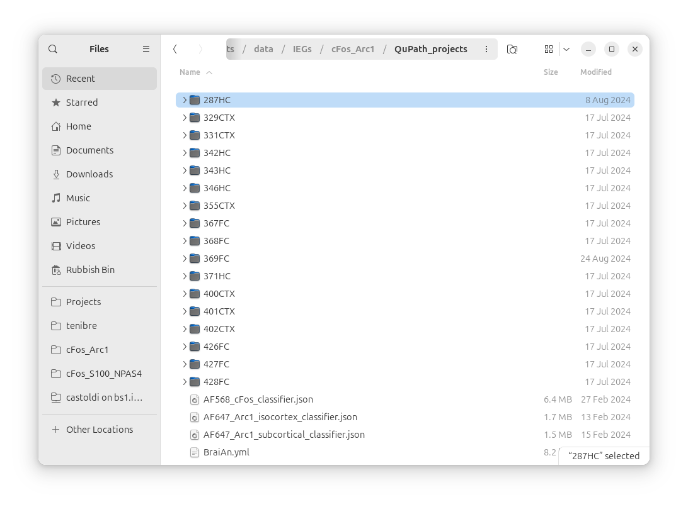
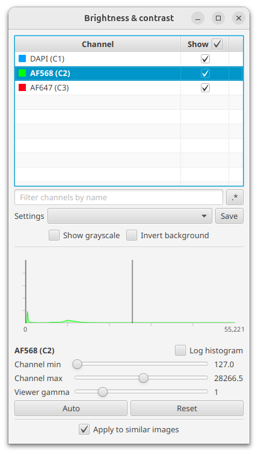

# Multi-channel image analysis
<!-- create classifier -->
<!-- run scripts faster -->
With this tutorial we will guide you into:

* reading a configuration file of BraiAnDetect
* apply the parameters for cell detection specified in the config file for each image channel
* compute markers' co-labelling
* exclude brain regions
* export results to CSV file

All code in this page pretty much traces [this script](https://github.com/carlocastoldi/qupath-extension-braian/blob/master/src/main/resources/scripts/compute_classify_overlap_export_exclude_detections.groovy), available in `Extensions ‣ BraiAn ‣ scripts` in QuPath.

## Before we start

We want to import all necessary dependencies

```groovy
import qupath.ext.braian.*
import qupath.ext.braian.config.*

import static qupath.lib.scripting.QP.*
```

## Configuration file
BraiAnDetect can read a [YAML](https://en.wikipedia.org/wiki/YAML) configuration file to specify basic information about a project and its data.

Here we use the [example](https://github.com/carlocastoldi/qupath-extension-braian/blob/master/BraiAn.yml) configuration file that is in the extension's Git repository, and here commented.

First we read a file named `BraiAn.yml`. It searches it in the QuPath projects's folder or, if not found, in the parent folder which supposedly contains all the projects of the same experiment.

```groovy
var config = ProjectsConfig.read("BraiAn.yml")
```



## Region of interests

BraiAnDetect operates over regions of interests defined in each image. You can select them by specifying their [QuPath classification](https://qupath.readthedocs.io/en/stable/docs/concepts/objects.html#classification) in the configuration file:

<div class="snippet">
  <pre><span class="filename">BraiAn.yml</span><code class="language-yaml hljs"><span class="hljs-attr">classForDetections:</span> <span class="hljs-literal">null</span></code></pre>
</div>

You can call `getAnnotationsForDetections()` to search such annotations. If `null` it returns a full-image annotation, effectively selecting the whole image with no focus on any particular region.

```groovy
ImageData imageData = getCurrentImageData()
PathObjectHierarchy hierarchy = imageData.getHierarchy()
Collection<PathAnnotationObject> annotations = config.getAnnotationsForDetections(hierarchy)
```

## Segmentation

Given a list of `annotations`, BraiAnDetect then can manage object segmentation, within the ROIs, for each of the given image channels.\
As of now, segmentation is managed through [QuPath algorithm](https://qupath.readthedocs.io/en/stable/docs/tutorials/cell_classification.html#run-cell-detection-command) and all of its parameters can be specified in the configuration file, for each channel:

<div class="snippet">
  <pre><span class="filename">BraiAn.yml</span><code class="language-yaml hljs"><span class="hljs-attr">channelDetections:</span>
  <span class="hljs-bullet">-</span> <span class="hljs-attr">name:</span> <span class="hljs-string">"AF568"</span> <span class="hljs-comment"># cFos</span>
    <span class="hljs-string">...</span>

  <span class="hljs-bullet">-</span> <span class="hljs-attr">name:</span> <span class="hljs-string">"AF647"</span> <span class="hljs-comment"># Arc</span>
    <span class="hljs-attr">parameters:</span>
      <span class="hljs-attr">requestedPixelSizeMicrons:</span> <span class="hljs-number">1</span>
      <span class="hljs-comment"># Nucleus parameters</span>
      <span class="hljs-attr">backgroundRadiusMicrons:</span> <span class="hljs-number">20</span>
      <span class="hljs-attr">backgroundByReconstruction:</span> <span class="hljs-literal">true</span>
      <span class="hljs-attr">medianRadiusMicrons:</span> <span class="hljs-number">0.0</span>
      <span class="hljs-attr">sigmaMicrons:</span> <span class="hljs-number">1.5</span>
      <span class="hljs-attr">minAreaMicrons:</span> <span class="hljs-number">40.0</span>
      <span class="hljs-attr">maxAreaMicrons:</span> <span class="hljs-number">1000.0</span>
      <span class="hljs-comment"># Intensity parameters</span>
      <span class="hljs-comment"># threshold: -1</span>
      <span class="hljs-attr">watershedPostProcess:</span> <span class="hljs-literal">true</span>
      <span class="hljs-comment"># Cell parameters</span>
      <span class="hljs-attr">cellExpansionMicrons:</span> <span class="hljs-number">5.0</span>
      <span class="hljs-attr">includeNuclei:</span> <span class="hljs-literal">true</span>
      <span class="hljs-comment"># General parameters</span>
      <span class="hljs-attr">smoothBoundaries:</span> <span class="hljs-literal">true</span>
      <span class="hljs-attr">makeMeasurements:</span> <span class="hljs-literal">true</span>
</code></pre>
</div>

For an in-depth description of what each parameter do, we suggest you to look at the [example](https://github.com/carlocastoldi/qupath-extension-braian/blob/master/BraiAn.yml) configuration file.

For each image channel, we can compute the detections within the ROIs accordingly to `detectionsConf.parameters`:

```groovy
var server = imageData.getServer()
var allDetections = []
for(ChannelDetectionsConfig detectionsConfig in config.channelDetections) {
    var channel = new ImageChannelTools(detectionsConf.name, server)
    try {
        var detections = new ChannelDetections(channel, annotations, detectionsConf.parameters, hierarchy)
        allDetections.add(detections)
    } catch (IllegalArgumentException ignored) {}
}
```

### Automatic threshold

Sometimes it is hard to determine the best threshold used by QuPath's watershed algorithm for the a whole brain. Lots of factors may play a role in each section image (section size, section quality, acquisition, density,...), making it a daunting task to fine tune the threshold to the best value, for each of them.\
For this reason BraiAnDetect offers an interface for automatically choosing a threshold based on the intensity histogram derived from the corresponding image.



In order to apply this automatic-threshold, you specify a couple of `histogramThreshold` parameters in the configuration file, and BraiAn will replace any value in `threshold` with the one computed from the image histogram.

<div class="snippet">
  <pre><span class="filename">BraiAn.yml</span><code class="language-yaml hljs"><span class="hljs-attr">channelDetections:</span>
  <span class="hljs-bullet">-</span> <span class="hljs-attr">name:</span> <span class="hljs-string">"AF568"</span> <span class="hljs-comment"># cFos</span>
    <span class="hljs-string">...</span>

  <span class="hljs-bullet">-</span> <span class="hljs-attr">name:</span> <span class="hljs-string">"AF647"</span> <span class="hljs-comment"># Arc</span>
    <span class="hljs-string">parameters</span>
      <span class="hljs-string">...</span>
      <span class="hljs-attr">histogramThreshold:</span>
        <span class="hljs-attr">resolutionLevel:</span> <span class="hljs-number">4</span>
        <span class="hljs-attr">smoothWindowSize:</span> <span class="hljs-number">15</span>
        <span class="hljs-attr">peakProminence:</span> <span class="hljs-number">30</span>
        <span class="hljs-attr">nPeak:</span> <span class="hljs-number">1</span>
    <span class="hljs-string">...</span>
</code></pre>
</div>

Effectively, it:

* computes the intensity histogram of the current image at the given resolution level. The higher `resolutionLevel` the faster, at the cost of sampling fewer pixels from which to build the histogram;
* applies a moving average to smooth the histogram's curve. The bigger the `smoothWindowSize`, the more secondary peaks will be flattened out;
* picks the `nPeak`-th peak with prominence _at least_ equal to `peakProminence`, and uses it as **threshold** for the current image.

What it does behind the curtain is very similar to the following python code:

```groovy
// QuPath script
import qupath.ext.braian.*

var server = getCurrentServer()
print server.nResolutions()
var resolutionLevel = 4
var h = new ImageChannelTools("AF568", server).getHistogram(resolutionLevel)
println h.values
```

```python
# python script
import numpy as np
import plotly.graph_objects as go
from scipy.signal import filtfilt
from scipy.signal import find_peaks

h = [633474, 3981, 5143, 2732, 1444, 1116, 930, 561, 322, ...] # histogram from QuPath script
h = np.array(h)
smoothWindowSize = 15
peakProminence = 30

smoothed = filtfilt(np.ones(smoothWindowSize) / smoothWindowSize, 1, h[5:])
peaks = find_peaks(smoothed, prominence=peakProminence)

fig = go.Figure([
    go.Scatter(y=h[5:], name="histogram"),
    go.Scatter(y=smoothed, name="smoothed", marker_color="green"),
    go.Scatter(x=peaks[0], y=smoothed[peaks[0]], name="peaks",
               mode="markers", marker_size=8, marker_color="red")
])\
.update_layout(
    paper_bgcolor="rgba(0,0,0,0)",
    plot_bgcolor="rgba(0,0,0,0)",
    template="simple_white"
).update_xaxes(title="#pixels", range=(0,len(h)))
```
