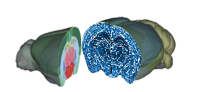

# BraiAn

BraiAn is a collection of two toolkits for whole-**brai**n quantitative **an**alysis of histological data from large datasets.
We designed it for the analysis of whole-brain data derived from serial 2D sections previously aligned to a 3D reference atlas (for example using ABBA). The idea is to simplify signal quantification, data analysis and data visualisation of large datasets typically obtained in whole-brain imaging experiments. One of the first projects in which we applied BraiAn consisted of quantifying the expression of three different immediate eraly genes (cFos, Arc and NPAS4) to assess neural activation patterns following learning. (see [_Chiaruttini, Castoldi et al. 2024_](https://doi.org/10.1101/2024.09.06.611625)). Analysis of this experimental dataset is going to be used here as examples.\ 
This site contains the project documentation for both its modules:

* [BraiAnDetect](), an extension for QuPath for image analysis; and
* [BraiAnalyse](braian-python.md), a Python library (`braian`) for navigation, analysis and visualisation of the obtained whole-brain data.

YSK: BraiAn's name stands for _**Brai**n **An**alysis_.\
I suggest you to listen to "[Brianstorm](https://en.wikipedia.org/wiki/Brianstorm)" by Arctic Monkey while working with BraiAn ;)



## How to cite BraiAn

If you use BraiAn in your work, please cite the paper below, currently in pre-print:

!!! important "Reference"
    Chiaruttini, N., Castoldi, C. et al. **ABBA, a novel tool for whole-brain mapping, reveals brain-wide differences in immediate early genes induction following learning**. _bioRxiv_ (2024).\
    [https://doi.org/10.1101/2024.09.06.611625](https://doi.org/10.1101/2024.09.06.611625)

## Contributing

We decided to publish the BraiAn pipeline with the most libre licence possible because we find maximum value in learning from others
and sharing our own—small—knowledge.

We, developers in neuroscience, are islands that often work alone and frequently end up reinventing the wheel rather then spending time finding, pickup up and adapting the work that somebody, from the other side of the world, did with no intention to publish. For this reason we spent a great amount of our personal time making the modules as usable, extensible, and long-lasting as we could. And yet, we know it could be better, that there could be bugs, unforeseen scenarios and missing features.

For this reason we hope that, _if you find our work useful_, you will find time and will to contribute back upstream with issues, PRs, documentation, tests, feature requests... _Any_ activity makes us happy!\
Repositories:

* _BraiAn for QuPath_: [https://github.com/carlocastoldi/qupath-extension-braian](https://github.com/carlocastoldi/qupath-extension-braian)
* `braian` library: [https://codeberg.org/SilvaLab/BraiAn](https://codeberg.org/SilvaLab/BraiAn)