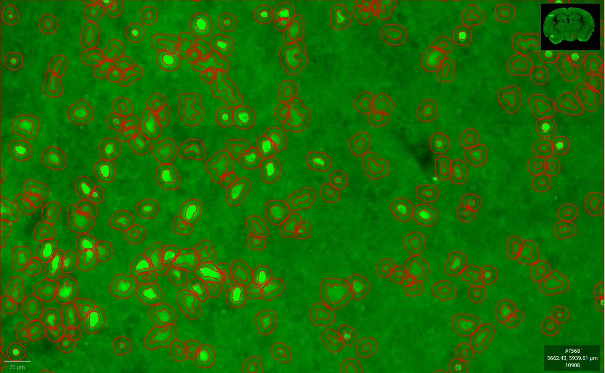
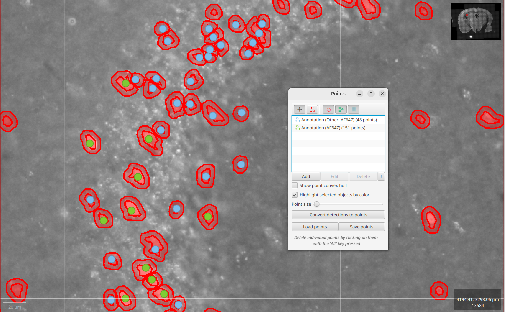
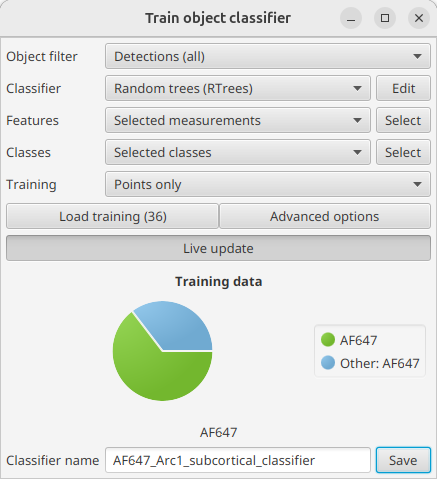
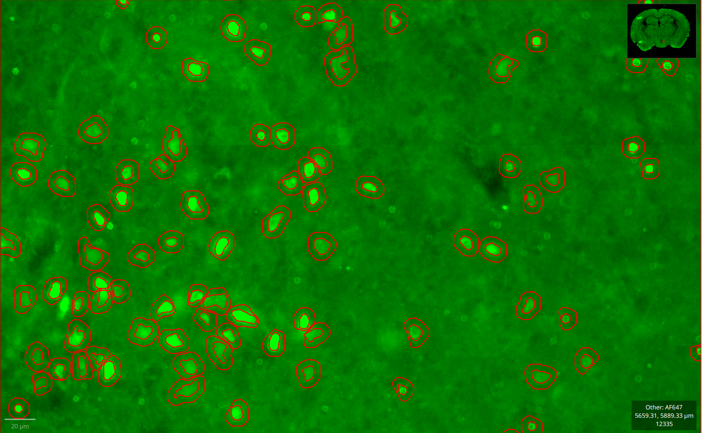

# ML-assisted segmentation

In some situations you may see that typical [object segmentation](image-analysis.md#segmentation) does not suffice our needs. Sometimes the settings are not always spot on between animals, sections or even brain regions, and we can't find some parameters that fits them all. In italian we refer to this as the "too-short-blanket-problem"!

In order to go around this problem, we came up with a different segmentation workflow. One that proved to be quite good with immediate-early-genes

## The workflow

The workflow consists of:

1. determining a set of [parameters](https://qupath.readthedocs.io/en/stable/docs/tutorials/cell_classification.html#run-cell-detection-command) that manages to identify close-to-all positive cells, at the expenses of taking lots of false detections
2. training an object classifier based on the detections computed in the previous step; one for each image channel. This classifier will determine whether each detection is a _real_ positive cell or not;
3. apply the classifier in the regions-of-interest. If more classifiers are needed, they'll be applied in sequence.

!!! warning
    Classifiers are mostly specific to the experiment conditions, the marker used, the acquisition specifics and the brain regions they were trained on, among all. This makes it close-to-impossible to share a classifier across multiple experiments, unless it was specifically trained with a diverse dataset.

### Classifiers in the configuration file

BraiAn offers an interface for classifiers in its YAML configuration file too:
<div class="snippet">
  <pre><span class="filename">BraiAn.yml</span><code class="language-yaml hljs">
...
channelDetections:
  - name: "AF647" # Arc1
    parameters:
        ...
    classifiers:
      - name: "AF647_Arc1_subcortical_classifier"
      - name: "AF647_Arc1_cortical_classifier"
        annotationsToClassify:
          - "Isocortex"
          - "CTXsp"
          - "OLF"
          - "CA1"
</code></pre>
</div>

This configuration means that BraiAn will first applies a classifiers named `AF647_Arc1_subcortical_classifier` to all detections computed on AF647 channel; then it will apply `AF647_Arc1_cortical_classifier` classifier only to AF647 detections that are within the given brain regions (i.e. isocortex, amygdala, olfactory bulb and field CA1), effectively resetting any previous applied classification.

## Parameter setting

<!-- cell expansion, show examples -->
When defining the parameters for your [object classification](https://qupath.readthedocs.io/en/stable/docs/tutorials/cell_classification.html#run-cell-detection-command), usually what works best is to choose a low `sigmaMicrons` as well a wide range of `minAreaMicrons:maxAreaMicrons`.
Most importantly, however, you should always compute the cell expansions: `cellExpansionMicrons`.

As a matter of fact, QuPath's object classifiers don't work by reading pixels off the image. Instead, they take as input the [object measurements](https://qupath.readthedocs.io/en/latest/docs/concepts/measurements.html) computed for every single detection. This means that if you don't do any cell expansion, the classifier will only work with pre-computed statistics coming from the pixels within the detection, effectively loosing any information about the surrounding context. Expanding the detection by, let's say, $5µm$ will effectively allow the classifier to draw conclusions also based on the statistical comparisons between the actual detection (i.e. the _nucleus_ in QuPath's terms) and the near-abouts (i.e. the _cytoplasm_).



!!! tip
    To run the detection for all projects at once we suggest you too take a look at [QuPath's command line interface](https://qupath.readthedocs.io/en/stable/docs/advanced/command_line.html#subcommands) (CLI).

## Classifier training
### Dataset preparation

In order to create a classifier, we suggest you to resort to an ad-hoc QuPath project. This project should be representative of the whole dataset to which you want to apply the classifier, with detections computed with the very same parameters.

The [`classifier_sample_images.groovy` script](https://github.com/carlocastoldi/qupath-extension-braian/blob/master/src/main/resources/scripts/classifier_sample_images.groovy), accessible also through `Extensions ‣ BraiAn ‣ scripts`, comes in handy for this task. It randomly samples a set number of images from each project and copies all its data into the currently opened QuPath project; pre-computed detection included.

### Labelling

With _labelling_ we intend, in this scenario, the act of creating a project with a large amount of detection being _manually_ classified as **true positive** or **false positive cell**.\
The resulting set of labels should, in fact, be representative of the whole population of detections in the regions-of-interest that you want to classify. For this reason it's best for you to avoid any involuntary bias given by choices made by the human operator (e.g. which slices, which animals, which regions, which cells,... to label?).

A part from using the above-mentioned script, we suggest you to show the counting grid overlay (`Shift+G`) in QuPath, and randomly select one of its squares. You should then label every single detection inside this square, be it classifying it as `AF647` or as `Other: AF647`—if detections refer to image channel "AF647"—whether they are true or false positive cells, respectively. Each image slice in the project should have approximately the same number of detections classified, and you should either choose to label **all** detection inside a square or **none** of them. No in-between.

!!! tip
    You can read more about object classifiers over in [QuPath's documentation](https://qupath.readthedocs.io/en/stable/docs/tutorials/cell_classification.html).

The best way to do the labelling, to our knowledge, is by using the Point tool (`.` in QuPath), with two sets of points: one for the true positive (classification: `<channel name>`) and one for false positive (classification: `Other: <channel name>`).



### Training

<!-- GUIDELINES - LUCAS
1. make an unbias training set. Only after we can do the classifier
2. make the training/validation/test set splits
3. accuracy for all groups of mice

4. ANN_MPL: at least one hidden layer
5. RTree: most importantly - maximum number of trees (log tests) and max depth (not more than 15)
6. feature norm: min-max
7. inter-annotator agreement
-->

Once we have made an unbiased training set, we can train the classifier. We can do so within QuPath's interface clicking on `Classify ‣ Object classification ‣ Train object classifier`.\
Following are the options that we, SilvaLab, usually select. Changes may be needed depending on the your dataset and requirements:

* Object filter: _Detections (all)_
* Classifier: _Random trees (RTrees)_
    + Maximum tree depth: 10 (generally, less than 15)
    + Maximum number of trees: 100
    + Calculate variable importance; it generally gives a good idea of the classifier's specifics behind the scenes through the log panel (`Ctrl+Shift+L`)
* Features: _Selected measurements_
    + here we usually start by selecting all features that are _not_ referring to any image channel other than the one we want to train the classifier for.
    You can use a similar regex filter to this: `^((?!DAPI|AF568|AF594|AF488).)*$`
* Classes: _Selected classes_:
    + "AF647"
    + "Other: AF647"
* Training: _Points only_
* Load training: select all images in the QuPath project
* Advanced options:
    + Feature normalization: _Min & max_



## Classification

The configuration [previously](#classifiers-in-the-configuration-file) shown can be read into [`PartialClassifiers`](https://carlocastoldi.github.io/qupath-extension-braian/docs/qupath/ext/braian/PartialClassifier.html). `PartialClassifier` is a class that associates an object classifier to a set of annotations, effectively applying it only to the detections within those same annotations.

The following script shows how it can read a YAML configuration file, search for the partial classifiers and apply them in the same order as they are written in the YAML file.

```groovy
import qupath.ext.braian.*
import qupath.ext.braian.config.ProjectsConfig

import static qupath.lib.scripting.QP.*

var imageData = getCurrentImageData()
var hierarchy = imageData.getHierarchy()
var config = ProjectsConfig.read("BraiAn.yml")
var annotations = config.getAnnotationsForDetections(hierarchy)

// RETRIEVE PRE-COMPUTED CHANNEL DETECTIONS
var allDetections = config.channelDetections.collect { detectionsConf -> new ChannelDetections(detectionsConf.name, hierarchy) }

// CLASSIFY CHANNEL DETECTIONS
allDetections.forEach { detections ->
    var detectionsConfig = config.channelDetections.find { detectionsConf -> detectionsConf.name == detections.getId() }
    if (detectionsConfig.classifiers == null)
        return
    var partialClassifiers = detectionsConfig.classifiers.collect{ it.toPartialClassifier(hierarchy) }
    detections.applyClassifiers(partialClassifiers, imageData)
}
```

When the scripts calls [`classifier.toPartialClassifier(hierarchy)`](https://carlocastoldi.github.io/qupath-extension-braian/docs/qupath/ext/braian/config/ChannelClassifierConfig.html#toPartialClassifier(qupath.lib.objects.hierarchy.PathObjectHierarchy)), BraiAn will search for the classifiers JSON files, called `AF647_Arc1_subcortical_classifier.json` and `AF647_Arc1_cortical_classifier.json`, within the current project's directory or in its parent directory: the [same procedure](braian-qupath.md#configuration-file) used when searching for `ProjectsConfig`.



<!-- ## Classifier evaluation -->